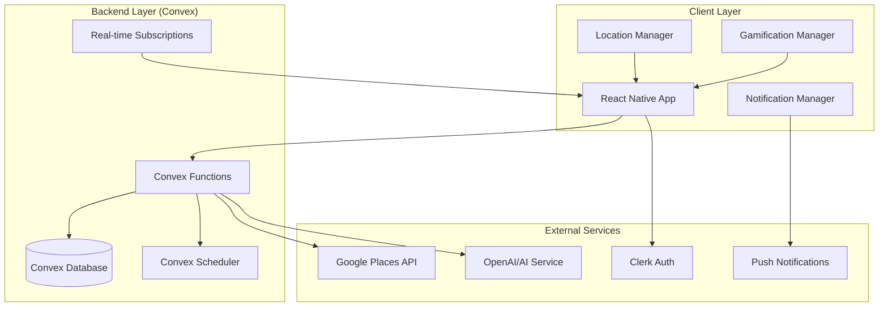
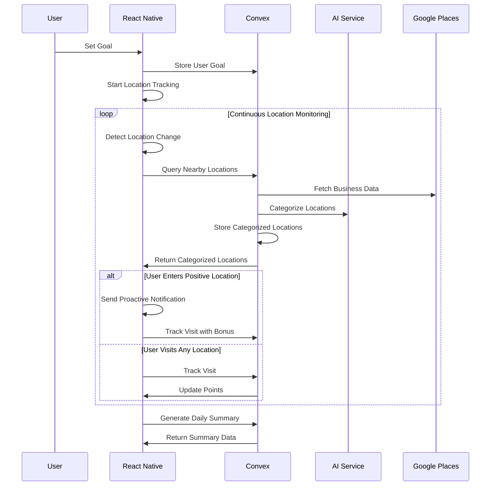

# Design Document

## Overview

Narby is a React Native mobile application that leverages geolocation services, AI-powered business categorization, and social gamification to help users align their daily activities with personal goals. The app uses Convex as the backend platform, Clerk for authentication, and integrates with external APIs for location data and AI processing.

The core architecture follows a client-server model where the React Native app handles user interface, location tracking, and real-time notifications, while Convex manages data persistence, AI processing, and real-time synchronization across users and groups.

## Architecture

### High-Level System Architecture



### Data Flow Architecture



## Components and Interfaces

### Core React Native Components

#### 1. Location Services Manager
```typescript
interface LocationManager {
  startLocationTracking(): Promise<void>;
  stopLocationTracking(): void;
  getCurrentLocation(): Promise<Location>;
  setupGeofences(locations: CategorizedLocation[]): void;
  onLocationChange(callback: (location: Location) => void): void;
  onGeofenceEnter(callback: (location: CategorizedLocation) => void): void;
}
```

#### 2. AI Integration Service
```typescript
interface AIService {
  categorizeLocation(location: BusinessLocation, userGoal: string): Promise<LocationCategory>;
  batchCategorizeLocations(locations: BusinessLocation[], userGoal: string): Promise<LocationCategory[]>;
  interpretUserGoal(goalStatement: string): Promise<GoalInterpretation>;
}
```

#### 3. Notification Manager
```typescript
interface NotificationManager {
  scheduleProactiveNotification(location: CategorizedLocation, bonusMultiplier: number): void;
  sendAchievementNotification(achievement: Achievement): void;
  sendSocialNotification(socialEvent: SocialEvent): void;
  configurePushNotifications(): Promise<void>;
}
```

#### 4. Gamification Engine
```typescript
interface GamificationEngine {
  calculatePoints(visit: LocationVisit, location: CategorizedLocation): number;
  updateStreak(userId: string, visitDate: Date): Promise<StreakData>;
  checkAchievements(userId: string, activity: UserActivity): Promise<Achievement[]>;
  generateDailySummary(userId: string, date: Date): Promise<DailySummary>;
}
```

### Screen Components

#### 1. Onboarding Flow
- **GoalSetupScreen**: Natural language goal input with AI validation
- **PermissionsScreen**: Location and notification permission requests
- **TutorialScreen**: App functionality walkthrough

#### 2. Main Application Screens
- **DashboardScreen**: Real-time points, current streak, nearby locations
- **MapScreen**: Interactive map showing categorized locations
- **LeaderboardScreen**: Group rankings and social features
- **ProfileScreen**: User settings, goal management, privacy controls
- **SummaryScreen**: Daily/weekly/monthly progress reports

#### 3. Social Features
- **GroupDiscoveryScreen**: Browse and join public goals
- **GroupManagementScreen**: Create and manage private groups
- **AchievementsScreen**: Badges, streaks, and milestone tracking

### Convex Backend Functions

#### 1. User Management
```typescript
import { mutation, query, internalMutation } from "./_generated/server";
import { v } from "convex/values";
import { internal } from "./_generated/api";
import { Auth } from "convex/server";

// Helper function to get authenticated user ID
export const getUserId = async (ctx: { auth: Auth }) => {
  return (await ctx.auth.getUserIdentity())?.subject;
};

// User goal and profile management
export const setUserGoal = mutation({
  args: { 
    goalStatement: v.string(),
    privacySettings: v.optional(v.object({
      shareLocationDetails: v.boolean(),
      shareSpecificLocations: v.boolean(),
      allowRealTimeTracking: v.boolean(),
      notificationDelay: v.number(),
    }))
  },
  handler: async (ctx, args) => {
    const userId = await getUserId(ctx);
    if (!userId) throw new Error("User not authenticated");
    
    // Schedule AI goal interpretation
    await ctx.scheduler.runAfter(0, internal.ai.interpretGoal, {
      userId,
      goalStatement: args.goalStatement,
    });
    
    // Store or update user profile
    const existingUser = await ctx.db
      .query("users")
      .withIndex("by_clerk_user_id", (q) => q.eq("clerkUserId", userId))
      .first();
      
    if (existingUser) {
      await ctx.db.patch(existingUser._id, {
        goalStatement: args.goalStatement,
        privacySettings: args.privacySettings || existingUser.privacySettings,
        lastActive: Date.now(),
      });
    } else {
      await ctx.db.insert("users", {
        clerkUserId: userId,
        goalStatement: args.goalStatement,
        goalInterpretation: {
          keywords: [],
          categories: [],
          pointingCriteria: [],
          confidence: 0,
        },
        privacySettings: args.privacySettings || {
          shareLocationDetails: false,
          shareSpecificLocations: false,
          allowRealTimeTracking: false,
          notificationDelay: 30,
        },
        notificationPreferences: {
          proactiveNotifications: true,
          socialNotifications: true,
          achievementNotifications: true,
          dailySummary: true,
        },
        createdAt: Date.now(),
        lastActive: Date.now(),
      });
    }
  }
});

export const getUserProfile = query({
  args: {},
  handler: async (ctx) => {
    const userId = await getUserId(ctx);
    if (!userId) return null;
    
    return await ctx.db
      .query("users")
      .withIndex("by_clerk_user_id", (q) => q.eq("clerkUserId", userId))
      .first();
  }
});
```

#### 2. Location Management
```typescript
// Location discovery and categorization
export const getNearbyLocations = query({
  args: { 
    latitude: v.number(), 
    longitude: v.number(), 
    radius: v.optional(v.number()) // Default radius based on population density
  },
  handler: async (ctx, args) => {
    const userId = await getUserId(ctx);
    if (!userId) return [];
    
    const user = await ctx.db
      .query("users")
      .withIndex("by_clerk_user_id", (q) => q.eq("clerkUserId", userId))
      .first();
      
    if (!user) return [];
    
    // Calculate dynamic radius based on location (city vs rural)
    const searchRadius = args.radius || calculateDynamicRadius(args.latitude, args.longitude);
    
    // Query existing categorized locations within radius
    const existingLocations = await ctx.db
      .query("locations")
      .filter((q) => {
        // Simple distance calculation - in production would use geospatial indexing
        const distance = calculateDistance(
          args.latitude, args.longitude,
          q.field("coordinates.latitude"), q.field("coordinates.longitude")
        );
        return q.lt(distance, searchRadius);
      })
      .collect();
    
    // If we have recent data, return it
    const recentLocations = existingLocations.filter(
      loc => Date.now() - loc.lastUpdated < 24 * 60 * 60 * 1000 // 24 hours
    );
    
    if (recentLocations.length > 0) {
      return recentLocations;
    }
    
    // Otherwise, schedule background location discovery
    await ctx.scheduler.runAfter(0, internal.locations.discoverAndCategorize, {
      userId,
      latitude: args.latitude,
      longitude: args.longitude,
      radius: searchRadius,
      goalId: user.goalInterpretation,
    });
    
    return existingLocations; // Return stale data while fresh data is being processed
  }
});

export const categorizeNewLocations = mutation({
  args: { 
    locations: v.array(v.object({
      placeId: v.string(),
      name: v.string(),
      address: v.string(),
      latitude: v.number(),
      longitude: v.number(),
      businessType: v.array(v.string()),
    })),
    goalInterpretation: v.object({
      keywords: v.array(v.string()),
      categories: v.array(v.string()),
      pointingCriteria: v.array(v.any()),
      confidence: v.number(),
    })
  },
  handler: async (ctx, args) => {
    const userId = await getUserId(ctx);
    if (!userId) throw new Error("User not authenticated");
    
    // Schedule AI categorization for each location
    for (const location of args.locations) {
      await ctx.scheduler.runAfter(0, internal.ai.categorizeLocation, {
        location,
        goalInterpretation: args.goalInterpretation,
        userId,
      });
    }
  }
});
```

#### 3. Visit Tracking
```typescript
// Location visit recording and point calculation
export const recordLocationVisit = mutation({
  args: {
    locationId: v.string(),
    visitDuration: v.number(),
    visitType: v.union(v.literal("automatic"), v.literal("manual")),
    bonusMultiplier: v.optional(v.number())
  },
  handler: async (ctx, args) => {
    // Record visit, calculate points, update streaks
  }
});
```

#### 4. Social Features
```typescript
// Group management and social interactions
export const createGroup = mutation({
  args: { 
    goalStatement: v.string(), 
    isPublic: v.boolean(),
    groupName: v.string() 
  },
  handler: async (ctx, args) => {
    // Create new group with shared goal
  }
});

export const getGroupLeaderboard = query({
  args: { groupId: v.id("groups") },
  handler: async (ctx, args) => {
    // Return real-time leaderboard data
  }
});
```

## Data Models

### Core Data Structures

#### 1. User Profile
```typescript
interface UserProfile {
  _id: Id<"users">;
  clerkUserId: string;
  goalStatement: string;
  goalInterpretation: GoalInterpretation;
  privacySettings: PrivacySettings;
  notificationPreferences: NotificationPreferences;
  createdAt: number;
  lastActive: number;
}

interface GoalInterpretation {
  keywords: string[];
  categories: string[];
  pointingCriteria: PointingCriteria[];
  confidence: number;
}
```

#### 2. Location and Business Data
```typescript
interface CategorizedLocation {
  _id: Id<"locations">;
  placeId: string; // Google Places ID
  name: string;
  address: string;
  coordinates: {
    latitude: number;
    longitude: number;
  };
  businessType: string[];
  pointValue: number;
  categoryReason: string;
  goalAlignment: GoalAlignment;
  lastUpdated: number;
}

interface GoalAlignment {
  goalId: Id<"goals">;
  alignmentScore: number;
  reasoning: string;
  userOverrides: UserOverride[];
}
```

#### 3. Visit Tracking
```typescript
interface LocationVisit {
  _id: Id<"visits">;
  userId: string;
  locationId: Id<"locations">;
  visitDate: number;
  duration: number;
  pointsEarned: number;
  bonusMultiplier?: number;
  visitType: "automatic" | "manual" | "proactive_bonus";
  coordinates: {
    latitude: number;
    longitude: number;
  };
}
```

#### 4. Social and Group Features
```typescript
interface Group {
  _id: Id<"groups">;
  name: string;
  goalStatement: string;
  goalInterpretation: GoalInterpretation;
  isPublic: boolean;
  createdBy: string;
  members: GroupMember[];
  createdAt: number;
  settings: GroupSettings;
}

interface GroupMember {
  userId: string;
  joinedAt: number;
  role: "admin" | "member";
  privacyLevel: "full" | "points_only" | "activity_only";
  notificationDelay: number; // minutes
}
```

#### 5. Gamification Data
```typescript
interface UserStats {
  _id: Id<"userStats">;
  userId: string;
  currentStreak: number;
  longestStreak: number;
  totalPoints: number;
  dailyPoints: number;
  weeklyPoints: number;
  monthlyPoints: number;
  achievements: Achievement[];
  lastStreakDate: number;
}

interface Achievement {
  id: string;
  name: string;
  description: string;
  iconUrl: string;
  unlockedAt: number;
  category: "streak" | "points" | "social" | "exploration";
}
```

### Database Schema (Convex)

```typescript
export default defineSchema({
  users: defineTable({
    clerkUserId: v.string(),
    goalStatement: v.string(),
    goalInterpretation: v.object({
      keywords: v.array(v.string()),
      categories: v.array(v.string()),
      pointingCriteria: v.array(v.any()),
      confidence: v.number(),
    }),
    privacySettings: v.object({
      shareLocationDetails: v.boolean(),
      shareSpecificLocations: v.boolean(),
      allowRealTimeTracking: v.boolean(),
      notificationDelay: v.number(),
    }),
    notificationPreferences: v.object({
      proactiveNotifications: v.boolean(),
      socialNotifications: v.boolean(),
      achievementNotifications: v.boolean(),
      dailySummary: v.boolean(),
    }),
    createdAt: v.number(),
    lastActive: v.number(),
  }).index("by_clerk_user_id", ["clerkUserId"]),

  locations: defineTable({
    placeId: v.string(),
    name: v.string(),
    address: v.string(),
    coordinates: v.object({
      latitude: v.number(),
      longitude: v.number(),
    }),
    businessType: v.array(v.string()),
    pointValue: v.number(),
    categoryReason: v.string(),
    goalAlignment: v.object({
      goalId: v.id("goals"),
      alignmentScore: v.number(),
      reasoning: v.string(),
      userOverrides: v.array(v.object({
        userId: v.string(),
        overrideValue: v.number(),
        reason: v.string(),
        timestamp: v.number(),
      })),
    }),
    lastUpdated: v.number(),
  }).index("by_place_id", ["placeId"])
    .index("by_coordinates", ["coordinates.latitude", "coordinates.longitude"]),

  visits: defineTable({
    userId: v.string(),
    locationId: v.id("locations"),
    visitDate: v.number(),
    duration: v.number(),
    pointsEarned: v.number(),
    bonusMultiplier: v.optional(v.number()),
    visitType: v.union(v.literal("automatic"), v.literal("manual"), v.literal("proactive_bonus")),
    coordinates: v.object({
      latitude: v.number(),
      longitude: v.number(),
    }),
  }).index("by_user_id", ["userId"])
    .index("by_user_date", ["userId", "visitDate"]),

  groups: defineTable({
    name: v.string(),
    goalStatement: v.string(),
    goalInterpretation: v.object({
      keywords: v.array(v.string()),
      categories: v.array(v.string()),
      pointingCriteria: v.array(v.any()),
      confidence: v.number(),
    }),
    isPublic: v.boolean(),
    createdBy: v.string(),
    members: v.array(v.object({
      userId: v.string(),
      joinedAt: v.number(),
      role: v.union(v.literal("admin"), v.literal("member")),
      privacyLevel: v.union(v.literal("full"), v.literal("points_only"), v.literal("activity_only")),
      notificationDelay: v.number(),
    })),
    createdAt: v.number(),
    settings: v.object({
      allowNewMembers: v.boolean(),
      requireApproval: v.boolean(),
      maxMembers: v.optional(v.number()),
    }),
  }).index("by_public", ["isPublic"])
    .index("by_creator", ["createdBy"]),

  userStats: defineTable({
    userId: v.string(),
    currentStreak: v.number(),
    longestStreak: v.number(),
    totalPoints: v.number(),
    dailyPoints: v.number(),
    weeklyPoints: v.number(),
    monthlyPoints: v.number(),
    achievements: v.array(v.object({
      id: v.string(),
      name: v.string(),
      description: v.string(),
      iconUrl: v.string(),
      unlockedAt: v.number(),
      category: v.union(v.literal("streak"), v.literal("points"), v.literal("social"), v.literal("exploration")),
    })),
    lastStreakDate: v.number(),
  }).index("by_user_id", ["userId"]),

  goals: defineTable({
    statement: v.string(),
    interpretation: v.object({
      keywords: v.array(v.string()),
      categories: v.array(v.string()),
      pointingCriteria: v.array(v.any()),
      confidence: v.number(),
    }),
    isShared: v.boolean(),
    createdBy: v.string(),
    usageCount: v.number(),
    createdAt: v.number(),
  }).index("by_shared", ["isShared"])
    .index("by_creator", ["createdBy"]),
});
```

## Error Handling

### Client-Side Error Handling

#### 1. Location Services Errors
- **Permission Denied**: Graceful degradation with manual location entry option
- **Location Unavailable**: Cached location data and offline mode
- **GPS Accuracy Issues**: Confidence scoring and user confirmation prompts

#### 2. Network Connectivity Errors
- **Offline Mode**: Local data caching and sync when connection restored
- **API Rate Limits**: Exponential backoff and request queuing
- **Server Errors**: User-friendly error messages and retry mechanisms

#### 3. AI Service Errors
- **Categorization Failures**: Fallback to neutral point values and user override options
- **Goal Interpretation Errors**: Request clarification from user with suggestions

### Backend Error Handling

#### 1. Data Validation
```typescript
// Input validation for all mutations
export const validateLocationVisit = (visit: LocationVisit): ValidationResult => {
  if (!visit.locationId || !visit.userId) {
    return { valid: false, error: "Missing required fields" };
  }
  if (visit.duration < 0 || visit.duration > 24 * 60 * 60 * 1000) {
    return { valid: false, error: "Invalid visit duration" };
  }
  return { valid: true };
};
```

#### 2. External API Error Handling
```typescript
// Robust external API integration
export const fetchGooglePlacesData = async (location: Coordinates): Promise<PlaceData[]> => {
  try {
    const response = await fetch(googlePlacesUrl, { /* config */ });
    if (!response.ok) {
      throw new Error(`Google Places API error: ${response.status}`);
    }
    return await response.json();
  } catch (error) {
    console.error("Google Places API failed:", error);
    // Return cached data or empty array
    return getCachedPlacesData(location) || [];
  }
};
```

## Testing Strategy

### Unit Testing

#### 1. Core Logic Testing
- **Point Calculation**: Test various scenarios for point assignment and bonus multipliers
- **Streak Calculation**: Test streak maintenance, breaks, and recovery
- **Goal Interpretation**: Test AI goal parsing with various input formats
- **Location Categorization**: Test business categorization accuracy

#### 2. Component Testing
- **Location Manager**: Mock location services and test geofence logic
- **Notification Manager**: Test notification scheduling and delivery
- **Gamification Engine**: Test achievement unlocking and progress tracking

### Integration Testing

#### 1. API Integration
- **Convex Functions**: Test all mutations and queries with realistic data
- **External APIs**: Test Google Places and AI service integration
- **Real-time Updates**: Test live data synchronization across clients

#### 2. Cross-Platform Testing
- **React Native**: Test on both iOS and Android devices
- **Location Services**: Test various location accuracy scenarios
- **Background Processing**: Test app behavior when backgrounded

### End-to-End Testing

#### 1. User Journey Testing
- **Onboarding Flow**: Complete user registration and goal setup
- **Location Tracking**: Simulate location changes and visit detection
- **Social Features**: Test group creation, joining, and leaderboard updates
- **Offline Scenarios**: Test app behavior without network connectivity

#### 2. Performance Testing
- **Location Processing**: Test with high-frequency location updates
- **Database Queries**: Test query performance with large datasets
- **Real-time Synchronization**: Test with multiple concurrent users

### Testing Tools and Framework

```typescript
// Jest configuration for React Native
module.exports = {
  preset: 'react-native',
  setupFilesAfterEnv: ['<rootDir>/src/test/setup.ts'],
  testMatch: ['**/__tests__/**/*.test.{js,jsx,ts,tsx}'],
  collectCoverageFrom: [
    'src/**/*.{js,jsx,ts,tsx}',
    '!src/**/*.d.ts',
    '!src/test/**/*',
  ],
  coverageThreshold: {
    global: {
      branches: 80,
      functions: 80,
      lines: 80,
      statements: 80,
    },
  },
};

// Example test structure
describe('LocationManager', () => {
  beforeEach(() => {
    jest.clearAllMocks();
  });

  test('should detect location visits correctly', async () => {
    // Test implementation
  });

  test('should handle location permission denial', async () => {
    // Test implementation
  });
});
```

## Security and Privacy Considerations

### Data Protection
- **Location Data Encryption**: All location data encrypted at rest and in transit
- **User Consent Management**: Granular privacy controls with clear explanations
- **Data Retention Policies**: Automatic deletion of old location data based on user preferences
- **Anonymization**: Group data shared without personally identifiable location details

### Authentication and Authorization
- **Clerk Integration**: Secure user authentication with social login options
- **API Security**: All Convex functions protected with proper authentication checks
- **Group Access Control**: Role-based permissions for group management features

### External API Security
- **API Key Management**: Secure storage and rotation of external service keys
- **Rate Limiting**: Implement client-side and server-side rate limiting
- **Data Validation**: Strict validation of all external API responses

## Environment Variables and Configuration

### Required Environment Variables

The following environment variables need to be added to support Narby's functionality:

#### Backend Environment Variables (packages/backend/convex/env.ts)
```typescript
export const backendEnvSchema = z.object({
  // Existing variables
  CONVEX_DEPLOYMENT: nonEmptyString.describe("Convex deployment configuration").optional(),
  CONVEX_URL: urlSchema.describe("Convex backend URL").optional(),
  CLERK_ISSUER_URL: urlSchema.describe("Clerk authentication issuer URL").optional(),
  OPENAI_API_KEY: nonEmptyString.describe("OpenAI API key for AI features").optional(),
  CONVEX_CLOUD_URL: urlSchema.describe("Convex cloud URL for deployment").optional(),
  
  // New variables for Narby
  GOOGLE_PLACES_API_KEY: nonEmptyString.describe("Google Places API key for location data").optional(),
  GOOGLE_MAPS_API_KEY: nonEmptyString.describe("Google Maps API key for geocoding").optional(),
  EXPO_PUSH_ACCESS_TOKEN: nonEmptyString.describe("Expo push notification access token").optional(),
});
```

#### Native App Environment Variables (apps/native/.env.local)
```env
EXPO_PUBLIC_CONVEX_URL=https://your-deployment.convex.cloud
EXPO_PUBLIC_CLERK_PUBLISHABLE_KEY=pk_test_...
EXPO_PUBLIC_GOOGLE_MAPS_API_KEY=AIza...
```

### Internal Actions and Scheduled Functions

#### AI Processing Actions
```typescript
// convex/ai.ts
import { internalAction, internalMutation } from "./_generated/server";
import { v } from "convex/values";
import { internal } from "./_generated/api";
import { env } from "./env";
import OpenAI from "openai";

export const interpretGoal = internalAction({
  args: {
    userId: v.string(),
    goalStatement: v.string(),
  },
  handler: async (ctx, args) => {
    const apiKey = env.OPENAI_API_KEY;
    if (!apiKey) {
      console.error("OpenAI API key not configured");
      return;
    }

    const openai = new OpenAI({ apiKey });
    
    const prompt = `Analyze this personal goal and extract key information for location categorization: "${args.goalStatement}"
    
    Return JSON with:
    - keywords: array of relevant keywords
    - categories: array of business/location categories that align with this goal
    - pointingCriteria: array of criteria for assigning positive/negative points
    - confidence: number 0-1 indicating how well the goal can be interpreted`;

    try {
      const response = await openai.chat.completions.create({
        messages: [
          {
            role: "system",
            content: "You are an expert at analyzing personal goals and determining how different types of businesses and locations would align with those goals. Return valid JSON only."
          },
          { role: "user", content: prompt }
        ],
        model: "gpt-4-1106-preview",
        response_format: { type: "json_object" },
      });

      const interpretation = JSON.parse(response.choices[0]?.message.content || "{}");
      
      await ctx.runMutation(internal.ai.saveGoalInterpretation, {
        userId: args.userId,
        interpretation,
      });
    } catch (error) {
      console.error("Goal interpretation failed:", error);
    }
  },
});

export const categorizeLocation = internalAction({
  args: {
    location: v.object({
      placeId: v.string(),
      name: v.string(),
      address: v.string(),
      latitude: v.number(),
      longitude: v.number(),
      businessType: v.array(v.string()),
    }),
    goalInterpretation: v.object({
      keywords: v.array(v.string()),
      categories: v.array(v.string()),
      pointingCriteria: v.array(v.any()),
      confidence: v.number(),
    }),
    userId: v.string(),
  },
  handler: async (ctx, args) => {
    const apiKey = env.OPENAI_API_KEY;
    if (!apiKey) {
      console.error("OpenAI API key not configured");
      return;
    }

    const openai = new OpenAI({ apiKey });
    
    const prompt = `Given this location and user goal, assign a point value:
    
    Location: ${args.location.name} (${args.location.businessType.join(", ")})
    Address: ${args.location.address}
    
    User Goal Keywords: ${args.goalInterpretation.keywords.join(", ")}
    Goal Categories: ${args.goalInterpretation.categories.join(", ")}
    
    Return JSON with:
    - pointValue: number between -10 and +10 (negative for misaligned, positive for aligned)
    - reasoning: string explaining the point assignment
    - alignmentScore: number 0-1 indicating confidence in the categorization`;

    try {
      const response = await openai.chat.completions.create({
        messages: [
          {
            role: "system",
            content: "You are an expert at evaluating how well businesses and locations align with personal goals. Be thoughtful about point assignments and provide clear reasoning."
          },
          { role: "user", content: prompt }
        ],
        model: "gpt-4-1106-preview",
        response_format: { type: "json_object" },
      });

      const categorization = JSON.parse(response.choices[0]?.message.content || "{}");
      
      await ctx.runMutation(internal.ai.saveLocationCategorization, {
        location: args.location,
        categorization,
        goalInterpretation: args.goalInterpretation,
      });
    } catch (error) {
      console.error("Location categorization failed:", error);
    }
  },
});

export const saveGoalInterpretation = internalMutation({
  args: {
    userId: v.string(),
    interpretation: v.object({
      keywords: v.array(v.string()),
      categories: v.array(v.string()),
      pointingCriteria: v.array(v.any()),
      confidence: v.number(),
    }),
  },
  handler: async (ctx, args) => {
    const user = await ctx.db
      .query("users")
      .withIndex("by_clerk_user_id", (q) => q.eq("clerkUserId", args.userId))
      .first();
      
    if (user) {
      await ctx.db.patch(user._id, {
        goalInterpretation: args.interpretation,
      });
    }
  },
});

export const saveLocationCategorization = internalMutation({
  args: {
    location: v.object({
      placeId: v.string(),
      name: v.string(),
      address: v.string(),
      latitude: v.number(),
      longitude: v.number(),
      businessType: v.array(v.string()),
    }),
    categorization: v.object({
      pointValue: v.number(),
      reasoning: v.string(),
      alignmentScore: v.number(),
    }),
    goalInterpretation: v.object({
      keywords: v.array(v.string()),
      categories: v.array(v.string()),
      pointingCriteria: v.array(v.any()),
      confidence: v.number(),
    }),
  },
  handler: async (ctx, args) => {
    // Check if location already exists
    const existingLocation = await ctx.db
      .query("locations")
      .withIndex("by_place_id", (q) => q.eq("placeId", args.location.placeId))
      .first();

    const locationData = {
      placeId: args.location.placeId,
      name: args.location.name,
      address: args.location.address,
      coordinates: {
        latitude: args.location.latitude,
        longitude: args.location.longitude,
      },
      businessType: args.location.businessType,
      pointValue: args.categorization.pointValue,
      categoryReason: args.categorization.reasoning,
      goalAlignment: {
        goalId: "temp" as any, // Will be updated with proper goal reference
        alignmentScore: args.categorization.alignmentScore,
        reasoning: args.categorization.reasoning,
        userOverrides: [],
      },
      lastUpdated: Date.now(),
    };

    if (existingLocation) {
      await ctx.db.patch(existingLocation._id, locationData);
    } else {
      await ctx.db.insert("locations", locationData);
    }
  },
});
```

#### Location Discovery Actions
```typescript
// convex/locations.ts
import { internalAction } from "./_generated/server";
import { v } from "convex/values";
import { internal } from "./_generated/api";
import { env } from "./env";

export const discoverAndCategorize = internalAction({
  args: {
    userId: v.string(),
    latitude: v.number(),
    longitude: v.number(),
    radius: v.number(),
    goalId: v.object({
      keywords: v.array(v.string()),
      categories: v.array(v.string()),
      pointingCriteria: v.array(v.any()),
      confidence: v.number(),
    }),
  },
  handler: async (ctx, args) => {
    const apiKey = env.GOOGLE_PLACES_API_KEY;
    if (!apiKey) {
      console.error("Google Places API key not configured");
      return;
    }

    try {
      // Fetch nearby places from Google Places API
      const placesUrl = `https://maps.googleapis.com/maps/api/place/nearbysearch/json?location=${args.latitude},${args.longitude}&radius=${args.radius}&key=${apiKey}`;
      
      const response = await fetch(placesUrl);
      const data = await response.json();
      
      if (data.results && data.results.length > 0) {
        const locations = data.results.map((place: any) => ({
          placeId: place.place_id,
          name: place.name,
          address: place.vicinity || place.formatted_address || "",
          latitude: place.geometry.location.lat,
          longitude: place.geometry.location.lng,
          businessType: place.types || [],
        }));

        // Schedule categorization for discovered locations
        await ctx.runMutation(internal.locations.categorizeNewLocations, {
          locations,
          goalInterpretation: args.goalId,
        });
      }
    } catch (error) {
      console.error("Location discovery failed:", error);
    }
  },
});
```

This design provides a comprehensive foundation for building Narby as a full-featured geolocation accountability app with robust social features, AI integration, and scalable architecture using the specified technology stack. The design now includes proper Convex patterns, environment variable configuration, and complete function implementations that follow the existing codebase conventions.